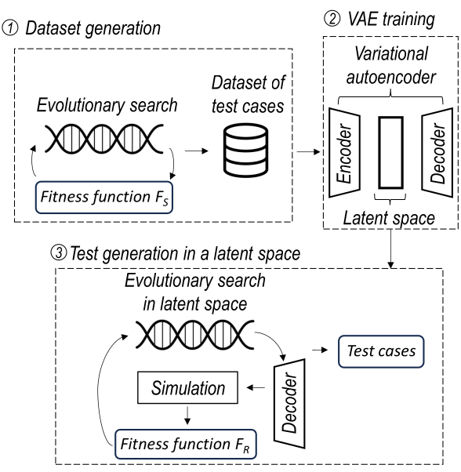

# RILaST - Representation Improvement in Latent Space for Search Based Testing of Autonomous Robotic Systems

<p align="center">
  <b>Current Tool Version: 1.0.</b>
</p>

We propose RILaST (Representation Improvement in Latent Space for Search-Based Testing) approach, which enhances test representation by mapping it to the latent space of a variational autoencoder. We evaluate RILaST on two use cases, including autonomous drone and autonomous lane-keeping assist systems. The obtained results show that RILaST allows finding between 3 to 4.6 times more failures than baseline approaches, achieving a high level of test diversity.

<p float="center" align="center">
   
</p>

## Installation

Clone the repository and install the dependencies. This project uses Python 3.9 and conda package manager.
```
git clone git@github.com:swat-lab-optimization/RILaST.git
cd RILaST
conda create -n rilast python=3.9
conda activate RILaST
pip install -r requirements.txt
```

## Framework overview
RILaST is a framework for test generation for autonomous robotic systems. It allows test generation in orginal as well as latent representation space. One of the main components that should be defined to use RILaST is a ```TestGenerator``` class. This class implements ```initialize_problem``` method, that in turn defines the classes that [generate the tests](rilast\generators\abstract_generator.py), [verify their validity](rilast\validators\abstract_validator.py) and [evaluate them with a simulator or a simplified fitness function ](rilast\evaluators\abstract_evaluator.py).

Here is an example of ```initialize_problem``` method implementation of a test generator for a lane keeping assist system.
```python
def initialize_executor(self):
    self.generator = KappaRoadGenerator(self.map_size, solution_size=self.nDim)
    self.validator = RoadValidator(self.generator, self.map_size)

    self.executor = BeamExecutor(
        self.beamng_executor, self.generator, test_validator=self.validator
    )

def initialize_problem(self):
    self.nDim = self.config["nDim"]
    self.initialize_executor()

    self.problem = LKASProblem(
        executor=self.executor,
        n_var=self.generator.size,
        min_fitness=self.executor.min_fitness,
        xl=self.generator.get_lb(),
        xu=self.generator.get_ub(),
    )
```
Here the ```KappaRoadGenerator``` is a class that generates tests for the lane keeping assist system. The ```RoadValidator``` class is used to verify the validity of the generated tests. The ```BeamExecutor``` class is used to evaluate the tests using the [BeamNG](https://beamng.tech/) simulator. The ```LKASProblem``` class is used to define the optimization problem within the [Pymoo framework](https://pymoo.org/index.html).
Each ```TestGenerator``` class should be accompanied by a [configuration file](rilast\test_generators\lkas_dataset_generator.py) that defines the parameters of the test generation process, such the hyperparameters of the optimization algorithm.

## Usage

As shown in the figure above, RILaST consists of three main components: dataset collection, VAE training, and optimization in the latent space. The following sections describe how to use RILaST for each of these steps. We provide examples of how to use RILaST for the lane keeping assist system test generation, but the same approach can be used for other autonomous robotic systems.

### Dataset collection

In RILaST approach, the first step consists of the collection of a dataset of tests. To create a dataset of randomly sampled tests, based on LKASTestGenerator you can use the following command:
```
python generate_dataset.py --module-name rilast.test_generators.lkas_dataset_generator --class-name LKASTestGenerator --dataset-size 10000
```
This command will generate a dataset of 10000 tests randomly based on the ```generator``` called inside ```LKASTestGenerator```. The generated dataset will be saved in the ```datasets``` folder by default.

To generate a dataset of optimized tests two commands need to be executed.
First, the dataset of tests should be generated through the search process using the following command:
```python
python generate_tests.py --module-name rilast.test_generators.lkas_dataset_generator --class-name LKASDatasetGenerator --runs 50 --algorithm ga --crossover one_point --mutation kappa
```
Here, in ```LKASDatasetGenerator``` class the ```executor``` is initialized with ```self.executor = CurveExecutor(self.generator, test_validator=self.validator)```, which uses the ```CurveExecutor``` calculating the road topology curvature to evalaute the tests, rather then the expensive BeamNG simulator. In this way we collect a dataset based on a simplified fitness function. The search will be executed 50 times.
In the [```config file```](rilast\test_generators\configs\lkas_dataset_generator.yaml) the parameters as population size, number of dimensions, termination criteria and budget are defined:
```
pop_size: 200
nDim: 17
termination: "n_gen"
budget: 50
```
After each run 200 tests will be generated and saved, as a result, 200x50=10000 tests will be produced. The produced test will be saved in ```experiments``` folder by default inside a ```<experiment_id>/<..._tcs.json>``` file.

Then, the dataset in ```npy``` format can be produced using the following command:
```python
python generate_dataset.py --module-name rilast.test_generators.lkas_dataset_generator --class-name LKASDatasetGenerator --tc-dir <experiments>/<experiment_id>/<..._tcs.json>
```
The produced dataset will be saved in the ```datasets``` folder by default.
### VAE training
Having produced the datasets, the next step is to train the VAE model. The VAE model can be trained using the ```train_vae.py``` script. Here is an example for training a VAE based on a random dataset for LKAS system testing:
```python
python train_vae.py --data-path datasets/dataset_random_ads.npy --epochs 1000 --ndim 17 --ldim 17
```
Here we indicate the path to the dataset, the number of epochs to train the VAE,  the size of the input vector specifying the test in original space  ```ndim```, and the number of dimensions of the latent space ```ldim```. The trained model will be saved in the ```models``` folder by default. Other default parameters include the batch size of 512, the learning rate of 0.001, and the Adam optimizer.

For more extended experiments and hypeparameter tuning we reccommend using wandb for tracking the training process. To do so, you need to create an account on [wandb](https://wandb.ai/) and run the following command:
```
wandb login
```
Then, you can run the training script with the following command:
```python
python train_vae_wandb.py --data-path datasets/dataset_random_ads.npy --epochs 1000 -ndim 17 --runs 5 --entity <your_wandb_username> --project <your_wandb_project_name>
```
You can specify the parameters to fine-tune in the dedicated config inside the script. An example of such config is shown below:
```python
sweep_config = {
    "method": "grid",
    "name": project_name,
    "metric": {
        "goal": "minimize",
        "name": "validation_loss"
    },
    "parameters": {
        "model": {"values": ["VAE1", "VAE2", "VAE3"]},
        "loss_func": {"values": ["lossA"]},
        "batch_size": {"values": [64, 128, 512]},
        "lr": {"values": [0.001, 0.0001]},
        "nlat": {"values": [17]},
        "ndim": {"values": [nDim]},
        "name": {"values": [project_name]}
    }
}
```
Here we vary the model architecture, batch size, and learning rate. The results of the training process will be tracked on the wandb dashboard.

### RILaST - optimization in the latent space

To use the trained VAE model for optimization in the latent space, you need to run the test generation with the test generator for latent space. It uses ```LatentGenerator``` for test generation as shown in the example below:
```python
self.original_generator = KappaRoadGenerator(self.map_size, solution_size=self.nDim)
self.generator = LatentGenerator(
    self.nLat, 0, 1, self.original_generator, self.model, self.transform, self.transform_norm
)
```
This is defined inside the ```initialize_executor```, as it was done before for the original test generator. The ```model``` is the trained VAE model, and the ```transform``` and ```transform_norm``` are the functions for normalization of the input vectors (tests). The ```model``` will be defined automatically by the [abstract test generator](rilast\test_generators\abstract_test_generator.py) if the path to the model as well as the dataset is provided in the configuration file. See an example of the configuration file for the latent test generator for [LKAS system](rilast\test_generators\configs\latent_lkas_test_generator.yaml).

An example of how to run the optimization in the latent space for the LKAS system is shown below :
```python
python generate_tests.py --module-name rilast.test_generators.latent_lkas_test_generator --class-name LatentLKASTestGenerator --runs 10 --algorithm ga --crossover sbx --mutation pm
```
## Replication Package for RIlaST experiments

### RQ1

### RQ2

### RQ3

### RQ4

### RQ5